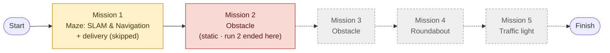
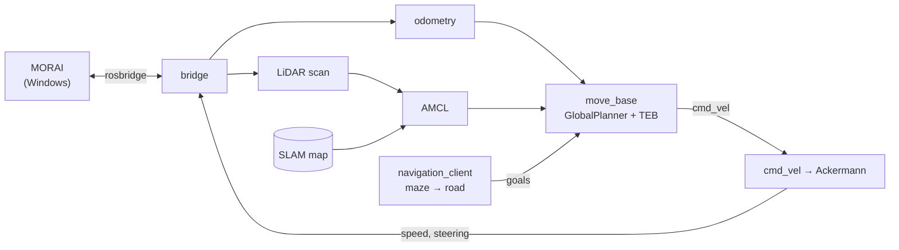

# 2025 Virtual Autorace — Autonomous Driving in the MORAI Simulator

**English** | [한국어](README_ko.md)

A four-person team's ROS1 stack that drove a WeGo 1/10 car through a maze in the MORAI simulator using a LiDAR SLAM map and AMCL localization (**no absolute position from the simulator**)

| | |
|---|---|
| Contest | 2025 Virtual Autorace (가상환경 자율주행 경진대회, MORAI · WeGo): preliminary presentation 2025.06.24, final run 2025.08.18 |
| Format | Organizer PC runs MORAI; each team's laptop runs its ROS Noetic stack, linked by Ethernet and rosbridge · 10-minute run · score = sum of mission points |
| Period | 2025.05.21 (entry)–2025.08.18 |
| Team | **Autonome** — Yoonju Jeong (team lead), Chaeyeon Kim, Sihyeon Park, Hyojeong Oh |
| Stack | ROS1 Noetic (WSL2) · MORAI (Windows) · gmapping · AMCL · move_base (GlobalPlanner + TEB) · OpenCV |
| Result | Exited the maze in the final run; stopped at the first static obstacle. Delivery mission not attempted. |

## What We Set Out to Do

- **Goal**: five missions in one 10-minute run — maze with delivery, two obstacle sections, roundabout, traffic light (details in [Mission and Result](#mission-and-result))
- **Constraint**: GPS, the Ego topic and MORAI's TF were banned, and manual localization was penalized, so the car had to know where it was on its own.
- **Before the contest**: the preliminary round (06.24) proposed a camera-centred design (YOLO, PRM, Behavior Tree, Pure Pursuit). The rules — Ubuntu 20.04 / ROS Noetic, no absolute position — pushed the final stack to LiDAR SLAM + AMCL (see [docs/postmortem.md](docs/postmortem.md#planned-vs-built)).
- **Approach**: build a map with LiDAR SLAM, localize on it with AMCL, plan with `move_base`, and let a small mission script send goals: one goal for the maze exit, then road waypoints.

## Mission and Result

Course order from the rulebook: start → maze (Mission 1) → lower road (Mission 2) → right side (Mission 3) → roundabout (Mission 4) → traffic-light crossroad (Mission 5) → finish.



| Mission | To pass (rulebook) | Fails or loses points if | Our result |
|---|---|---|---|
| **1. SLAM & Navigation** (maze) | Map built with our own SLAM · start without manual localization · pick up 2 objects and deliver to 1 target (stay within 1.2 m for 2 s; positions come from `/delivery_object`) · drive on to the arrival point | Manual localization at start or after drifting · hitting walls or obstacles · manual control after the start | Own map and automatic AMCL start ✓ · delivery ✗ (not implemented) · maze exited in run 2 ✓ |
| **2–3. Obstacles** (road; static or dynamic, revealed on the day) | Pedestrian: stop and wait, go when it leaves the lane · fixed obstacle: change lanes around it | Collision · leaving the outer lane · avoiding a pedestrian instead of stopping · stopped 10 s or more | Run 2 stopped at the first (static) obstacle → mission failed |
| **4. Roundabout** | Enter without hitting circulating cars and exit | Collision · not exiting · stopped 10 s or more · crossing the centre line (penalty) | Not reached |
| **5. Traffic light** | State comes as a ROS topic · red: stop within 0.3 m before the line · yellow: may slow down · green: start within 5 s and turn left on the planned route | Front wheels past the line on red · crossing the centre line or wrong direction | Not reached; no traffic-light logic in the final stack |

General rules: one 10-minute run · score = sum of mission points (ties broken by lap time and driving stability) · lane departure costs points in proportion to time outside the lane · GPS, the Ego topic and MORAI TF are banned · run order decided by lot.

| Attempt | Result |
|---|---|
| Run 1 | Stuck in the middle of the maze (Mission 1) |
| Run 2 | **Exited the maze** without delivery, then stopped at the first static obstacle (Mission 2) |

- Until contest day the car barely moved
- Contest day: rebuilt SLAM map in the morning, ×2 motor multiplier in the afternoon → out of the maze
- After the contest: found the real cause — TEB had been ignoring every tuned parameter (see [Key Problems](#key-problems))

## System



| Stage | What runs | Package |
|---|---|---|
| Mapping | gmapping → `map_saver` | `wego` |
| Localization | AMCL on the saved map + odometry | `wego_2d_nav` |
| Planning | GlobalPlanner (Dijkstra) + TEB (Ackermann, 0.755 m turning radius) | `wego_2d_nav` |
| Mission | one goal to the maze exit, then road waypoints every ~1 m | `wego` |
| Control | `cmd_vel` → Ackermann steering → MORAI motor/servo topics | `wego_2d_nav`, `racecar` |

## Team

|  |  |  |  |
|:---:|:---:|:---:|:---:|
| **Chaeyeon Kim**<br/>[@ChaeYeonKim0204](https://github.com/ChaeYeonKim0204) | **Sihyeon Park**<br/>[@kha-2](https://github.com/kha-2) | **Hyojeong Oh**<br/>[@ohhyojeong](https://github.com/ohhyojeong) | **Yoonju Jeong**<br/>[@yoonju04](https://github.com/yoonju04) |
| Dev environment<br/>SLAM mapping<br/>Docs & operations | Navigation packages<br/>Speed fix<br/>Final integration | Problem analysis<br/>Odometry tests<br/>Dynamic obstacles | **Team lead**<br/>Camera perception<br/>Lane & planner design |

## Contributions

### Participation by Area

◎ led · ○ actively contributed · △ took part

| | Area | **Chaeyeon Kim**<br/>@ChaeYeonKim0204 | **Sihyeon Park**<br/>@kha-2 | **Hyojeong Oh**<br/>@ohhyojeong | **Yoonju Jeong**<br/>@yoonju04 |
|---|---|:---:|:---:|:---:|:---:|
| Project | Team operations (meetings, schedule, venues, organizer contact) | ○ | △ | △ | ◎ |
| | Preliminary round (tech stack, plan, architecture, slides) | ◎ | ○ | ○ | ○ |
| | Dev environment and network (WSL2 ↔ MORAI, shared PC, two-PC Ethernet) | ◎ | ○ | ○ | △ |
| Driving stack | Perception (lanes, BEV, traffic light, pedestrians and obstacles) | ○ | ◎ | ○ | ○ |
| | Mapping (SLAM) | ◎ | ○ | ○ | △ |
| | Localization (AMCL, TF, odometry) | ○ | ◎ | ◎ |  |
| | Planning and control (move_base, TEB, costmap, speed) | △ | ◎ | ○ | ○ |
| | Mission logic and integration (navigation client, delivery, final stack) | △ | ◎ | △ |  |
| Common | Documentation (Notion notes, setup guides, GitHub) | ◎ | ○ | ○ | ○ |

<br/>

### Highlights by Member

| Member | Highlights |
|---|---|
| **Chaeyeon Kim**<br/>@ChaeYeonKim0204 | • Wrote the preliminary tech stack and plan<br/>• Ran MORAI + ROS on one laptop (WSL2) → team standard setup<br/>• Built the final contest map → planning failures 17–71 → 0–5 per run<br/>• Proposed the frame fix that stopped the TF jitter |
| **Sihyeon Park**<br/>@kha-2 | • Wrote the first lane node and the navigation packages<br/>• Set up the two-PC network (with Hyojeong Oh) and led TF/odom debugging<br/>• Enabled the ×2 multiplier that got the car out of the maze<br/>• Integrated the final contest stack |
| **Hyojeong Oh**<br/>@ohhyojeong | • Wrote the vehicle package setup guide<br/>• First through the maze, first clue to the TEB bug<br/>• Listed the TF/odom problems and ran the odometry experiments<br/>• Built the dynamic-obstacle pipeline |
| **Yoonju Jeong**<br/>@yoonju04<br/>Team lead | • Found and entered the contest, led the team<br/>• Wrote camera calibration and the bird's-eye view<br/>• Showed lanes-as-obstacles fail → designed lane → TEB via-points<br/>• Diagnosed the stalls as a planner (not map) problem |

<br/>

### Details by Member

<details>
<summary><b>Chaeyeon Kim</b> — dev environment · SLAM mapping · docs</summary>

**Preliminary round (06.24)**
- Tech stack: PRM, TEB, YOLO, OpenCV, Behavior Tree, Pure Pursuit
- R&D plan outline: roles, goals, strategy, skills, study plan
- Revised the slides and script after an AI review (added schedule and pipeline)

**Dev environment**
- Found that MORAI crashes in a VM (no GPU access) → ran MORAI on Windows and ROS Noetic in WSL2 (07.22–23)
- Shared the WSL ↔ Windows network guide (`netsh portproxy 9090`), provided the laptop that became the shared PC
- Proposed the two-PC Ethernet setup (07.22)

**Perception**
- Wrote `compute_pd_control` for the SEA:ME hackathon car (07.17), reused in the contest lane node
- Ported the lane node to MORAI camera/servo/motor topics and documented their units (07.26)

**Mapping and localization**
- Static TF from the rulebook's sensor positions and `pub_odom` launch for gmapping (08.03)
- After the first maps overlapped, documented the SLAM setup in Notion and set the gmapping parameters (08.03–06)
- Proposed switching the EKF frame back to `odom` (08.12) → TF jitter gone; found `base_link` disconnected in the rqt TF view
- 18 gmapping runs on the shared PC, **final contest map** (08.18 10:16)

**Planning, mission and docs**
- Found costmap settings missing from the lecture (08.11), researched waypoint planners (08.14–15)
- Proposed the Euler → quaternion conversion for delivery goals (08.13), re-recorded road waypoints (08.18)
- Notion notes (Day 7 SLAM/EKF/AMCL, Day 8 Navigation), communication with the organizers, GitHub

</details>

<br/>

<details>
<summary><b>Sihyeon Park</b> — lane node · navigation packages · final integration</summary>

**Preliminary round (06.23)**
- System architecture drafts v1 and v2 (SLAM → TF → Nav2, DWB controller)

**Perception**
- `plothistogram` / `sliding_window` for the SEA:ME hackathon car (07.16), first contest lane node (07.24)
- Yellow-lane mask, removed the lane-position check that ignored the right lane, first traffic-light attempt (07.26)

**Environment and network**
- Made the two-PC link work with Hyojeong Oh (08.05–07)
- Moved the stack to a borrowed laptop and fixed the build (08.11)

**Mapping, localization and planning**
- `wego` / `wego_2d_nav` skeleton, coordinate conversion, waypoint resampling, first navigation client (08.01–10)
- SLAM map on 08.07, main executor of TF/odom debugging (08.12)
- Traced TEB's `cmd_vel`, lowered `cost_scaling_factor` (08.13)

**Mission and integration**
- Delivery code (08.13–17, not integrated)
- Ported the stack back to the shared PC, built TEB, maze → road client, AMCL tuning (08.16–18)
- **×2 motor multiplier on contest day** (08.18 15:34) → car out of the maze

</details>

<br/>

<details>
<summary><b>Hyojeong Oh</b> — package setup · odometry · dynamic obstacles</summary>

**Preliminary round (06.24)**
- Risk-handling section: sensor fusion, Behavior Tree condition nodes, slow down / avoid / stop

**Environment and docs**
- Lecture 6 setup guide (static TF, `convert_lidar`, `pub_odom`), applied to the repository the same day (08.03)
- With Sihyeon Park, got the Ethernet link working (08.07); rqt parameter analysis (08.12)

**Planning**
- Global planner design note: chain per-segment Dijkstra, waypoints only where needed (08.10)
- **First maze exit** with maze-only goals (08.11) and the first sign that TEB ignored `max_vel_x`

**Localization**
- Listed the open problems: local plan, `/odom` jumping, `base_link` TF (08.12)
- Compared `pub_odom.py`, dual EKF and `publish_tf: false` (08.13)

**Perception and mission logic**
- Tested the instructor's HOG pedestrian example (07.30), MGeo publisher (08.03)
- DBSCAN clustering → velocity → pedestrian/vehicle classification, traffic-light handling (08.16–18, not integrated)

</details>

<br/>

<details>
<summary><b>Yoonju Jeong</b> — team lead · camera perception · planner design</summary>

**Team lead**
- Found the contest and proposed entering (05.21), ran the preliminary-round preparation (06.23–24)
- Ran meetings, schedules and role assignments

**Perception**
- Judged BEV necessary for the virtual camera (07.23), reported the missing camera node (07.24)
- Camera calibration + bird's-eye view (07.26), HOG vs YOLOv4 survey (07.30)

**Mapping and network**
- First `slam_gmapping` run (08.03), Ethernet attempt with Sihyeon Park (08.06)

**Planning**
- Showed that lanes as costmap obstacles fail with multiple and crossing lanes (08.07–13)
- Designed lane centerline → TEB via-points (08.14–16, not integrated)
- Diagnosed the stalls as a planner problem, not a map problem (08.16), compared waypoint, A* and SBPL planners

</details>

<br/>

Dated evidence for every item: [docs/contributions.md](docs/contributions.md)

## Key Problems

**1. MORAI would not run where ROS ran**
- Cause: no GPU access inside a VM; most laptops lacked disk space or GPU power for dual-boot.
- Fix: MORAI on Windows + ROS Noetic in WSL2, connected through rosbridge and a port proxy.
- Result: one laptop ran the whole stack for the rest of the contest.

**2. Distorted maps and phantom walls**
- Cause: the early maps overlapped — most likely because the EKF and `pub_odom.py` both published `odom → base_link` *(estimate)* — and gmapping kept exiting; later, the saved map still had ~2,500 pixels of phantom walls blocking paths.
- Fix: switching the EKF world frame to `map` left one `odom → base_link` publisher and a usable map came out (08.07); the map was rebuilt on contest day.
- Result: path-planning failures per run fell from 17–71 to 0–5.

**3. The car was too slow and got stuck — and no tuning helped**
- Cause (found after the contest): the TEB YAML key `TebLocalPlannerRos` did not match the namespace `TebLocalPlannerROS`, so TEB ignored every parameter and ran on defaults — 0.4 m/s top speed, zero turning radius, 1 m lookahead.
- During the contest: raising `max_vel_x` to 6 and even 100 changed nothing; the team bypassed it with a ×2 motor multiplier.
- Fix: one-line key rename on `main` (checked with `rosparam get`, not yet driven in MORAI).
- Lesson: when tuning does nothing, check what the node actually reads before changing more values.

**4. Localization jittered and odometry froze**
- Cause (found after the contest): the EKF was set to `world_frame: map` (the 08.07 map fix), so it published `map → odom` — the same transform AMCL publishes. Odometry itself was dead reckoning from motor speed and steering commands.
- During the contest: switching the frame back to `odom` (08.12) stopped the jitter; the rqt TF view then showed `base_link` disconnected when no node published `odom → base_link`.
- Lesson: one transform, one publisher — map out who publishes each TF edge before adding an EKF.

## Post-mortem

| Root cause | Effect | Status on `main` |
|---|---|---|
| TEB parameter file never applied (YAML key typo) | 0.4 m/s cap, infeasible turns, 1 m lookahead | Fixed, untested in MORAI |
| EKF and AMCL both published `map → odom` | `base_link` jitter, lost localization | Correct at contest time |
| Odometry from command dead reckoning | Noisy or frozen `/odom` | Open |
| Lane node: fixed 0.25 throttle, offset steering, crash with one lane | "PD" had no effect | Open |

If the typo had been fixed *(estimate)*: likely out of the maze in both runs and past the static obstacle. Teammates had prototypes for delivery, pedestrian detection and the traffic light, but none were merged — the delivery code needed small fixes, the traffic-light node subscribed to a misspelled topic and stopped on green, and pedestrian detection had no stop logic. A clean finish was unlikely.

Full analysis, missed clues, other defects and tuning history: [docs/postmortem.md](docs/postmortem.md)

## Quick Start

```bash
# ROS Noetic workspace, this repository as src/
rosdep install --from-paths src -i -y
catkin build && source devel/setup.bash

roslaunch rospy_rosbridge_connector bridge_all.launch   # MORAI ↔ ROS
roslaunch wego teleop.launch                            # TF, LiDAR, odometry
roslaunch wego gmapping.launch                          # mapping, then: rosrun map_server map_saver -f src/wego/maps/map
roslaunch wego navigation.launch                        # AMCL + move_base + mission
```

To run the exact contest-day code: `git checkout contest-2025-08-18`.

## Repository

- `lane_following/`: camera lane following (sliding window + proportional steering)
- `wego/`: vehicle bringup, SLAM, maps, waypoints, mission script
- `wego_2d_nav/`: AMCL, move_base, costmap and TEB parameters
- `morai_settings/`, `simulation_contest/`: files provided by the organizers
- `navigation/`, `teb_local_planner/`, `robot_localization/`, `slam_gmapping/`, `racecar/`, `vesc/`: open-source packages, vendored

## Docs

- [docs/contributions.md](docs/contributions.md): each member's work with evidence
- [docs/postmortem.md](docs/postmortem.md): TEB root cause, other defects, tuning history
- [docs/timeline.md](docs/timeline.md): development timeline and contest-day log
- [docs/repository.md](docs/repository.md): folder tree, branches and tags, third-party sources and licenses
