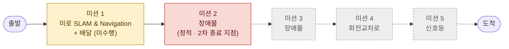
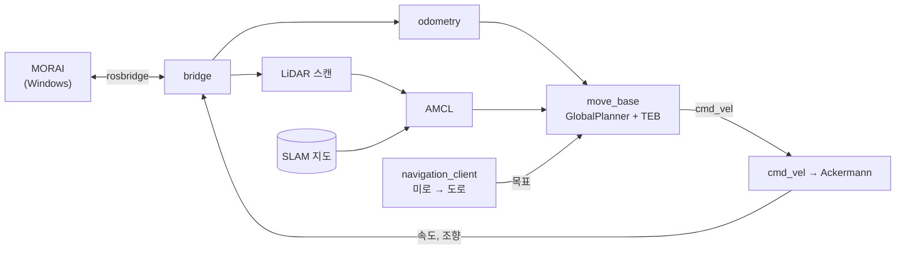

# 2025 Virtual Autorace — MORAI 시뮬레이터 자율주행

[English](README.md) | **한국어**

4인 팀의 ROS1 스택 — LiDAR SLAM 지도와 AMCL 위치 추정으로 MORAI 시뮬레이터의 WeGo 1/10 차량을 미로에서 주행 (**시뮬레이터 절대좌표 미사용**)

| | |
|---|---|
| 대회 | 2025 Virtual Autorace (가상환경 자율주행 경진대회, MORAI · WeGo): 예선 발표 2025.06.24, 본선 2025.08.18 |
| 방식 | 대회 측 PC에서 MORAI, 팀별 노트북에서 ROS Noetic 스택 실행, 이더넷·rosbridge 연결 · 주행 10분 · 점수 = 미션 점수 합계 |
| 기간 | 2025.05.21 (참가)~2025.08.18 |
| 팀 | **Autonome** — 정윤주 (팀장), 김채연, 박시현, 오효정 |
| 스택 | ROS1 Noetic (WSL2) · MORAI (Windows) · gmapping · AMCL · move_base (GlobalPlanner + TEB) · OpenCV |
| 결과 | 본선에서 미로 탈출 → 첫 정적 장애물에서 정지, 배달 미션 미시도 |

## 목표

- **목표**: 10분 주행 1회로 미션 5개 수행 — 미로·배달, 장애물 2구간, 회전교차로, 신호등 (상세: [미션·결과](#미션결과))
- **제약**: GPS, Ego 토픽, MORAI TF 사용 금지, 수동 위치 추정 시 감점 → 차량 자체 위치 추정 필요
- **대회 전**: 예선 (06.24)에서 카메라 중심 설계 (YOLO, PRM, Behavior Tree, Pure Pursuit) 제안 → 규정 (Ubuntu 20.04 / ROS Noetic, 절대좌표 금지)에 따라 최종 스택을 LiDAR SLAM + AMCL로 전환 ([docs/postmortem_ko.md](docs/postmortem_ko.md#계획과-구현) 참고)
- **접근**: LiDAR SLAM 지도 생성 → AMCL 위치 추정 → `move_base` 경로 계획 → 소규모 미션 스크립트로 목표 전달 (미로 출구 목표 1개, 이후 도로 waypoint)

## 미션·결과

규정서 기준 코스 순서: 출발 → 미로 (미션 1) → 아래쪽 도로 (미션 2) → 오른쪽 구간 (미션 3) → 회전교차로 (미션 4) → 신호등 교차로 (미션 5) → 도착



| 미션 | 성공 조건 (규정서) | 실패·감점 조건 | 결과 |
|---|---|---|---|
| **1. SLAM & Navigation** (미로) | 직접 SLAM으로 만든 지도 사용 · 수동 위치 추정 없이 출발 · 물체 2개 수령 후 목표 1곳에 배달 (1.2 m 이내 2초 대기, 위치는 `/delivery_object`로 제공) · 도착 위치까지 이동 | 출발 시·주행 중 수동 위치 추정 · 벽·장애물 충돌 · 출발 후 수동 조작 | 자체 지도·AMCL 자동 시작 ✓ · 배달 ✗ (미구현) · 2차에서 미로 탈출 ✓ |
| **2~3. 장애물** (도로, 정적·동적은 당일 공개) | 보행자: 정지·대기 후 차로 밖으로 나가면 출발 · 고정 장애물: 차선 변경으로 우회 | 충돌 · 차선 외곽 이탈 · 보행자 회피 주행 · 10초 이상 정지 | 2차에서 첫 정적 장애물 앞 정지 → 미션 실패 |
| **4. 회전교차로** | 회전 중인 차량과 충돌 없이 진입·탈출 | 충돌 · 탈출 실패 · 10초 이상 정지 · 중앙 차선 침범 (감점) | 미도달 |
| **5. 신호등** | 신호 상태는 ROS 토픽으로 수신 · 빨간불: 정지선 앞 0.3 m 이내 정지 · 노란불: 감속 가능 · 초록불: 5초 이내 출발, 정해진 경로로 좌회전 | 빨간불에 앞바퀴가 정지선 초과 · 중앙선 침범·잘못된 방향 | 미도달 · 최종 스택에 신호등 로직 없음 |

공통 규정: 10분 주행 1회 · 점수는 미션 점수 합산 (동점 시 랩 타임·주행 안정성) · 차선 이탈 시 이탈 시간에 비례해 감점 · GPS·Ego 토픽·MORAI TF 사용 금지 · 주행 순서는 추첨

| 시도 | 결과 |
|---|---|
| 1차 | 미로 중간에서 정지 (미션 1) |
| 2차 | 배달 없이 **미로 탈출** → 첫 정적 장애물에서 정지 (미션 2) |

- 대회 당일까지 차량이 거의 움직이지 못함
- 대회 당일: 오전 SLAM 지도 재생성, 오후 모터 배율 ×2 → 미로 탈출
- 대회 후: 실제 원인 확인 — TEB가 튜닝한 모든 파라미터를 무시하고 있었음 ([주요 문제](#주요-문제) 참고)

## 시스템



| 단계 | 실행 내용 | 패키지 |
|---|---|---|
| 지도 생성 | gmapping → `map_saver` | `wego` |
| 위치 추정 | 저장된 지도에서 AMCL + odometry | `wego_2d_nav` |
| 경로 계획 | GlobalPlanner (Dijkstra) + TEB (Ackermann, 회전 반경 0.755 m) | `wego_2d_nav` |
| 미션 | 미로 출구 목표 1개, 이후 약 1 m 간격 도로 waypoint | `wego` |
| 제어 | `cmd_vel` → Ackermann 조향 → MORAI 모터/서보 토픽 | `wego_2d_nav`, `racecar` |

## 팀

|  |  |  |  |
|:---:|:---:|:---:|:---:|
| **김채연**<br/>[@ChaeYeonKim0204](https://github.com/ChaeYeonKim0204) | **박시현**<br/>[@kha-2](https://github.com/kha-2) | **오효정**<br/>[@ohhyojeong](https://github.com/ohhyojeong) | **정윤주**<br/>[@yoonju04](https://github.com/yoonju04) |
| 개발 환경<br/>SLAM 지도 생성<br/>문서·운영 | 내비게이션 패키지<br/>속도 문제 수정<br/>최종 통합 | 문제 분석<br/>Odometry 실험<br/>동적 장애물 | **팀장**<br/>카메라 인식<br/>차선·플래너 설계 |

## 기여

### 영역별 참여

◎ 주도 · ○ 적극 참여 · △ 참여

| | 영역 | **김채연**<br/>@ChaeYeonKim0204 | **박시현**<br/>@kha-2 | **오효정**<br/>@ohhyojeong | **정윤주**<br/>@yoonju04 |
|---|---|:---:|:---:|:---:|:---:|
| 프로젝트 | 팀 운영 (회의·일정·장소·대회 측 연락) | ○ | △ | △ | ◎ |
| | 예선 (기술 스택·계획서·구조도·발표 자료) | ◎ | ○ | ○ | ○ |
| | 개발 환경·네트워크 (WSL2 ↔ MORAI·공용 PC·2-PC 이더넷) | ◎ | ○ | ○ | △ |
| 주행 스택 | 인지 (차선·BEV·신호등·보행자·장애물) | ○ | ◎ | ○ | ○ |
| | 지도 작성 (SLAM) | ◎ | ○ | ○ | △ |
| | 위치 추정 (AMCL·TF·odometry) | ○ | ◎ | ◎ |  |
| | 경로 계획·제어 (move_base·TEB·costmap·속도) | △ | ◎ | ○ | ○ |
| | 미션 로직·통합 (navigation client·배달·최종 스택) | △ | ◎ | △ |  |
| 공통 | 문서화 (Notion 정리·설치 가이드·GitHub) | ◎ | ○ | ○ | ○ |

<br/>

### 팀원별 주요 작업

| 팀원 | 주요 작업 |
|---|---|
| **김채연**<br/>@ChaeYeonKim0204 | • 예선 기술 스택·계획 작성<br/>• 노트북 1대로 MORAI + ROS 실행 (WSL2) → 팀 표준 환경<br/>• 본선 지도 생성 → 주행당 경로 계획 실패 17–71회 → 0–5회<br/>• TF 떨림을 멈춘 프레임 수정 제안 |
| **박시현**<br/>@kha-2 | • 초기 차선 노드·내비게이션 패키지 작성<br/>• PC 2대 네트워크 구성 (오효정과 공동)·TF/odom 디버깅 주도<br/>• 미로 탈출로 이어진 모터 배율 ×2 적용<br/>• 본선 스택 최종 통합 |
| **오효정**<br/>@ohhyojeong | • 차량 패키지 설치 가이드 작성<br/>• 첫 미로 탈출·TEB 버그의 첫 단서<br/>• TF/odom 문제 목록 정리·odometry 실험<br/>• 동적 장애물 파이프라인 구성 |
| **정윤주**<br/>@yoonju04<br/>팀장 | • 대회 발견·참가, 팀 운영<br/>• 카메라 캘리브레이션 + BEV(버드아이뷰) 작성<br/>• 차선을 장애물로 처리할 때 실패 확인 → 차선 → TEB via-points 설계<br/>• 정지 원인을 지도 문제가 아닌 플래너 문제로 진단 |

<br/>

### 팀원별 상세 기여

<details>
<summary><b>김채연</b> — 개발 환경 · SLAM 지도 생성 · 문서</summary>

**예선 (06.24)**
- 기술 스택: PRM, TEB, YOLO, OpenCV, Behavior Tree, Pure Pursuit
- 연구개발 계획 개요: 역할·목표·전략·기술·학습 계획
- AI 검토 후 슬라이드·대본 수정 (일정·파이프라인 추가)

**개발 환경**
- VM의 GPU 접근 불가로 MORAI 종료 확인 → Windows에서 MORAI·WSL2에서 ROS Noetic 실행 (07.22~23)
- WSL ↔ Windows 네트워크 안내 공유 (`netsh portproxy 9090`), 공용 PC가 된 노트북 제공
- 이더넷 기반 PC 2대 구성 제안 (07.22)

**인지**
- SEA:ME 해커톤 차량용 `compute_pd_control` 작성 (07.17), 대회 차선 노드에 재사용
- 차선 노드를 MORAI 카메라/서보/모터 토픽에 맞게 이식, 토픽 단위 정리 (07.26)

**지도 작성·위치 추정**
- 규정서 센서 위치에 따른 gmapping용 static TF·`pub_odom` launch (08.03)
- 초기 지도 겹침 후 Notion에 SLAM 구성 정리·gmapping 파라미터 설정 (08.03~08.06)
- EKF 프레임을 `odom`으로 복구 제안 (08.12) → TF 떨림 해소, rqt TF에서 `base_link` 연결 끊김 확인
- 공용 PC에서 gmapping 18회 실행, **본선 지도** 생성 (08.18 10:16)

**경로 계획·미션·문서**
- 강의에서 누락된 costmap 설정 확인 (08.11), waypoint 플래너 조사 (08.14~15)
- 배달 목표 Euler → quaternion 변환 제안 (08.13), 도로 waypoint 재기록 (08.18)
- Notion 정리 (Day 7 SLAM/EKF/AMCL, Day 8 Navigation), 대회 측 연락, GitHub

</details>

<br/>

<details>
<summary><b>박시현</b> — 차선 노드 · 내비게이션 패키지 · 최종 통합</summary>

**예선 (06.23)**
- 시스템 아키텍처 초안 v1·v2 (SLAM → TF → Nav2, DWB 컨트롤러)

**인지**
- SEA:ME 해커톤 차량용 `plothistogram` / `sliding_window` 작성 (07.16), 초기 대회 차선 노드 작성 (07.24)
- 노란 차선 마스크, 오른쪽 차선을 무시하던 차선 위치 검사 제거, 첫 신호등 정지 시도 (07.26)

**환경·네트워크**
- 오효정과 PC 2대 정상 연결 (08.05~07)
- 대여 노트북으로 스택 이전·빌드 수정 (08.11)

**지도 작성·위치 추정·경로 계획**
- `wego` / `wego_2d_nav` 기본 구조, 좌표 변환, waypoint 재샘플링, 초기 내비게이션 클라이언트 (08.01~10)
- SLAM 지도 생성 (08.07), TF/odom 디버깅 주 실행자 (08.12)
- TEB의 `cmd_vel` 추적, `cost_scaling_factor` 하향 (08.13)

**미션·통합**
- 배달 코드 작성 (08.13~17, 미통합)
- 공용 PC로 스택 재이식, TEB 빌드, 미로 → 도로 클라이언트, AMCL 튜닝 (08.16~18)
- **대회 당일 모터 배율 ×2 적용** (08.18 15:34) → 미로 탈출

</details>

<br/>

<details>
<summary><b>오효정</b> — 패키지 구성 · odometry · 동적 장애물</summary>

**예선 (06.24)**
- 위험 대응 절 작성: 센서 융합, Behavior Tree 조건 노드, 감속 / 회피 / 정지

**환경·문서**
- Lecture 6 설치 가이드 (static TF, `convert_lidar`, `pub_odom`), 같은 날 저장소 반영 (08.03)
- 박시현과 이더넷 정상 연결 (08.07), rqt 파라미터 분석 (08.12)

**경로 계획**
- 전역 플래너 설계 정리: 구간별 Dijkstra 연결, 필요한 지점에만 waypoint (08.10)
- 미로 전용 목표로 **첫 미로 탈출** (08.11), TEB가 `max_vel_x`를 무시한다는 첫 단서

**위치 추정**
- 미해결 문제 정리: 지역 경로, `/odom` 튐, `base_link` TF (08.12)
- `pub_odom.py`, 듀얼 EKF, `publish_tf: false` 비교 (08.13)

**인지·미션 로직**
- 강사의 HOG 보행자 예제 실험 (07.30), MGeo publisher 실험 (08.03)
- DBSCAN 클러스터링 → 속도 → 보행자/차량 분류, 신호등 처리 (08.16~18, 미통합)

</details>

<br/>

<details>
<summary><b>정윤주</b> — 팀장 · 카메라 인식 · 플래너 설계</summary>

**팀장**
- 대회 발견·참가 제안 (05.21), 예선 준비 진행 (06.23~24)
- 회의·일정·역할 분담 진행

**인지**
- 가상 카메라에 BEV 필요 판단 (07.23), 카메라 노드 부재 보고 (07.24)
- 카메라 캘리브레이션 + BEV 변환 (07.26), HOG vs YOLOv4 조사 (07.30)

**지도 작성·네트워크**
- 첫 `slam_gmapping` 실행 (08.03), 박시현과 이더넷 연결 시도 (08.06)

**경로 계획**
- 차선을 costmap 장애물로 처리할 때 다중·교차 차선에서 실패 확인 (08.07~13)
- 차선 중심선 → TEB via-points 설계 (08.14~16, 미통합)
- 정지 원인을 지도 문제가 아닌 플래너 문제로 진단 (08.16), waypoint·A*·SBPL 플래너 비교

</details>

<br/>

각 항목의 날짜별 근거: [docs/contributions_ko.md](docs/contributions_ko.md)

## 주요 문제

**1. ROS 실행 환경에서 MORAI 실행 불가**
- 원인: VM 내부 GPU 접근 불가, 대부분의 노트북은 디스크 공간·GPU 성능 부족으로 듀얼부팅 불가
- 해결: Windows의 MORAI + WSL2의 ROS Noetic, rosbridge·포트 프록시로 연결
- 결과: 이후 대회 기간 동안 노트북 1대로 전체 스택 실행

**2. 지도 왜곡·가짜 벽**
- 원인: EKF와 `pub_odom.py`의 `odom → base_link` 중복 발행으로 초기 지도 겹침 *(추정)*·gmapping 반복 종료, 이후 저장된 지도에도 경로를 막는 가짜 벽 약 2,500픽셀 잔존
- 해결: EKF world frame을 `map`으로 변경 → `odom → base_link` 발행자 1개로 사용 가능한 지도 생성 (08.07), 대회 당일 지도 재생성
- 결과: 주행당 경로 계획 실패 17–71회 → 0–5회

**3. 저속·정지 문제 — 튜닝 효과 없음**
- 원인 (대회 후 확인): TEB YAML 키 `TebLocalPlannerRos`와 namespace `TebLocalPlannerROS` 불일치 → TEB가 모든 파라미터를 무시하고 기본값 사용 — 최고 속도 0.4 m/s, 회전 반경 0, 전방 탐색 거리 1 m
- 대회 중: `max_vel_x`를 6, 나아가 100으로 높여도 변화 없음 → 모터 배율 ×2로 우회
- 수정: `main`에서 키 이름 한 줄 변경 (`rosparam get` 확인, MORAI 주행 미검증)
- 배운 점: 튜닝 효과가 없으면 값을 더 바꾸기 전에 노드가 실제로 읽는 값 확인

**4. 위치 추정 떨림·odometry 정지**
- 원인 (대회 후 확인): EKF의 `world_frame: map` 설정 (08.07 지도 수정 때 변경) → AMCL과 같은 `map → odom` 발행, odometry 자체는 모터 속도·조향 명령 기반 추측항법
- 대회 중: 프레임을 `odom`으로 되돌려 떨림 해소 (08.12), 이후 `odom → base_link` 발행 노드 부재 시 rqt TF에서 `base_link` 연결 끊김 확인
- 배운 점: 변환 1개당 발행자 1개 — EKF 추가 전 TF 연결별 발행자 정리

## 사후 분석

| 근본 원인 | 영향 | `main` 상태 |
|---|---|---|
| TEB 파라미터 파일 미적용 (YAML 키 오타) | 속도 제한 0.4 m/s, 불가능한 회전, 전방 탐색 거리 1 m | 수정 완료, MORAI 미검증 |
| EKF·AMCL 모두 `map → odom` 발행 | `base_link` 떨림, 위치 추정 상실 | 대회 당시 정상 설정 |
| 명령 기반 추측항법 odometry | `/odom` 잡음·정지 | 미해결 |
| 차선 노드: 고정 스로틀 0.25, 조향 오프셋, 차선 1개일 때 종료 | "PD" 효과 없음 | 미해결 |

오타 수정 시 *(추정)*: 두 시도 모두 미로 탈출·정적 장애물 통과 가능성 높음

팀원들이 배달·보행자 감지·신호등 프로토타입을 작성했으나 모두 미통합 — 배달 코드 소규모 수정 필요, 신호등 노드는 오타 토픽 구독·초록불에 정지, 보행자 감지에는 정지 로직 없음

무감점 완주 가능성 낮음

전체 분석·놓친 단서·기타 결함·튜닝 이력: [docs/postmortem_ko.md](docs/postmortem_ko.md)

## 빠른 시작

```bash
# ROS Noetic workspace, this repository as src/
rosdep install --from-paths src -i -y
catkin build && source devel/setup.bash

roslaunch rospy_rosbridge_connector bridge_all.launch   # MORAI ↔ ROS
roslaunch wego teleop.launch                            # TF, LiDAR, odometry
roslaunch wego gmapping.launch                          # mapping, then: rosrun map_server map_saver -f src/wego/maps/map
roslaunch wego navigation.launch                        # AMCL + move_base + mission
```

대회 당일 코드 그대로 실행: `git checkout contest-2025-08-18`

## 저장소

- `lane_following/`: 카메라 차선 추종 (sliding window + 비례 조향)
- `wego/`: 차량 구동 환경, SLAM, 지도, waypoint, 미션 스크립트
- `wego_2d_nav/`: AMCL, move_base, costmap·TEB 파라미터
- `morai_settings/`, `simulation_contest/`: 대회 측 제공 파일
- `navigation/`, `teb_local_planner/`, `robot_localization/`, `slam_gmapping/`, `racecar/`, `vesc/`: 저장소에 포함한 오픈소스 패키지

## 문서

- [docs/contributions_ko.md](docs/contributions_ko.md): 팀원별 작업·근거
- [docs/postmortem_ko.md](docs/postmortem_ko.md): TEB 근본 원인, 기타 결함, 튜닝 이력
- [docs/timeline_ko.md](docs/timeline_ko.md): 개발 일정·대회 당일 기록
- [docs/repository_ko.md](docs/repository_ko.md): 폴더 구조, 브랜치·태그, 외부 패키지 출처·라이선스
