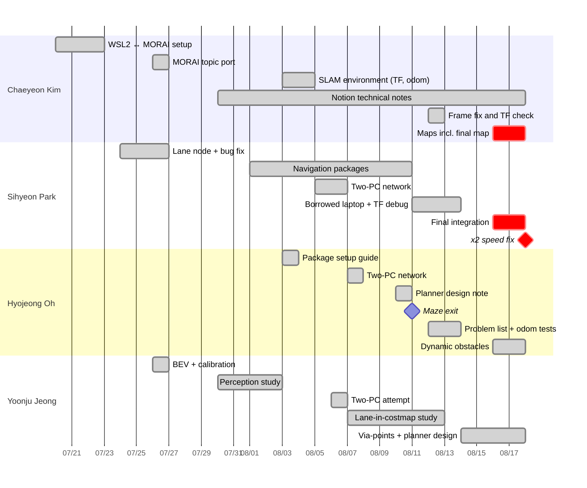

# Team Contributions

[← README](../README.md) · **English** | [한국어](contributions_ko.md)

## At a Glance

◎ led · ○ actively contributed · △ took part

| | Area | **Chaeyeon Kim** @ChaeYeonKim0204 | **Sihyeon Park** @kha-2 | **Hyojeong Oh** @ohhyojeong | **Yoonju Jeong** @yoonju04 |
|---|---|:---:|:---:|:---:|:---:|
| Project | Team operations (meetings, schedule, venues, organizer contact) | ○ | △ | △ | ◎ |
| | Preliminary round (tech stack, plan, architecture, slides) | ◎ | ○ | ○ | ○ |
| | Dev environment and network (WSL2 ↔ MORAI, shared PC, two-PC Ethernet) | ◎ | ○ | ○ | △ |
| Driving stack | Perception (lanes, BEV, traffic light, pedestrians and obstacles) | ○ | ◎ | ○ | ○ |
| | Mapping (SLAM) | ◎ | ○ | ○ | △ |
| | Localization (AMCL, TF, odometry) | ○ | ◎ | ◎ |  |
| | Planning and control (move_base, TEB, costmap, speed) | △ | ◎ | ○ | ○ |
| | Mission logic and integration (navigation client, delivery, final stack) | △ | ◎ | △ |  |
| Common | Documentation (Notion notes, setup guides, GitHub) | ◎ | ○ | ○ | ○ |

## Who Did What, When

---

## Chaeyeon Kim

[@ChaeYeonKim0204](https://github.com/ChaeYeonKim0204) · Dev environment · SLAM mapping · Docs · Operations

| Date | Work | Result |
|---|---|---|
| 06.24 | Preliminary round: wrote the tech stack (PRM, TEB, YOLO, OpenCV, Behavior Tree, Pure Pursuit) and the R&D plan outline (roles, goals, strategy, skills, study plan); used an AI review to add the schedule and pipeline, then edited the slides and script; hosted the shared slides | Presentation material for 06.24 |
| 07.07 – 07.08 | Shared the MORAI account setup with the team; planned the fallback environment (dual-boot on a spare PC) | Not needed after WSL2 |
| 07.17 | Wrote the lane-control function `compute_pd_control` for the SEA:ME hackathon car | Reused in the contest lane node (07.26) |
| 07.20 – 07.23 | Found that MORAI crashed in a VM because the VM could not see the GPU; ran MORAI on Windows and ROS Noetic in WSL2 | **Team's standard setup** (07.23); this laptop became the shared PC |
| 07.22 | Proposed splitting MORAI and ROS across two PCs over Ethernet | Used from 08.06 |
| 07.26 | Shared the rosbridge launch command (13:44); ported Sihyeon Park's 07.24 lane node to MORAI camera/servo/motor topics (14:53); documented the control-topic units (21:42) | First MORAI-connected lane node · speed 300 = 1 km/h, servo 0.5 = straight |
| 07.29 | WSL ↔ Windows network guide (key step: `netsh portproxy 9090` for rosbridge) | Used to connect ROS in WSL2 to MORAI |
| 08.03 | Static TF from the rulebook's sensor positions (imu 0, 0, 0.12 · lidar 0.11, 0, 0.13) and `pub_odom` launch for gmapping | SLAM setup committed |
| 08.03 – 08.04 | First SLAM runs | Distorted maps; gmapping kept exiting |
| 08.03 – 08.06 | After the overlapping maps, re-studied the Day 7 lecture; wrote the SLAM setup steps (packages, launch, what to comment out) in Notion and set the gmapping parameters | Prepared before the first usable map (08.07) |
| 08.11 | Compared our config with the Day 8 lecture | Found missing costmap settings (applied 08.12, no speed change) |
| 08.12 | Proposed switching the frame from `map` back to `odom`; later spotted in the rqt TF view that `base_link` was not connected | TF jitter gone; explained why odometry stopped updating |
| 08.13 | Delivery goal: x, y, z → quaternion | Proposed the Euler → quaternion conversion |
| 08.15 – 08.16 | Debugged a sudden costmap change on the shared PC | Cause not recorded |
| 08.16 – 08.18 | 18 gmapping runs, 4 saved maps | **Final map: path-planning failures 17–71 → 0–5 per run** |
| 08.18 | Re-recorded road waypoints from `/amcl_pose` | `amcl_waypoint_today2.csv` |
| throughout | Notion notes (Day 7 SLAM/EKF/AMCL, Day 8 Navigation), communication with the organizers, GitHub | Shared knowledge base and schedule |

## Sihyeon Park

[@kha-2](https://github.com/kha-2) · Lane & traffic light · Navigation packages · TF debugging · Final integration · Delivery

| Date | Work | Result |
|---|---|---|
| 06.23 | Preliminary round: researched control and obstacle avoidance, then took sensors and perception; posted the system architecture draft (v1, v2 adds SLAM → TF → Nav2 and a DWB controller) | Architecture for the slides |
| 07.16 | Wrote `plothistogram` / `sliding_window` for the SEA:ME hackathon car | Reused in the contest lane node |
| 07.24 | First lane node: HSV → ROI → sliding windows → steering (input `/camera/image_raw`, output `/commands/vel`) | Baseline for `lane_following` |
| 07.26 | Yellow-lane mask, `waitKey` and histogram fixes; removed the lane-position check it had added on 07.24 | **Right lane detected again** |
| 07.26 | First traffic-light stop attempt (`GetTrafficLightStatus`) | Not working yet (topic typo, stop overwritten by the main loop) |
| 07.29 – 07.31 | Offline training; asked the instructor with Hyojeong Oh about the absolute-position ban | Instructor suggested camera-based driving; team kept SLAM + AMCL + waypoints |
| 08.01 – 08.10 | `wego` / `wego_2d_nav` skeleton, coordinate conversion, waypoint resampling, first navigation client | Navigation stack in place (branch `history/sihyeon-laptop-2025-08`) |
| 08.05 – 08.07 | Tried the two-PC link with Yoonju Jeong (08.06), working with Hyojeong Oh (08.07) | All topics visible on the driving PC |
| 08.07 | Built the SLAM map (driven by Hyojeong Oh) after the first one was lost | Map for 08.07 – 08.15 driving |
| 08.11 | Moved to a borrowed laptop and fixed the build; traced how TEB produces `cmd_vel` | Still slow → performance hypothesis dropped |
| 08.12 | Main executor of TF/odom/localization debugging (applied the frame change, tested, reported) | Jitter gone, then tracking recovered; speed still low |
| 08.13 | Suspected the global path was too tight; lowered `cost_scaling_factor` | Slight improvement |
| 08.13 – 08.17 | Raised the x, y, z vs. quaternion issue; wrote the delivery code | Not integrated |
| 08.16 – 08.18 | Ported the stack to the shared PC, built TEB, maze → road client, AMCL tuning | Final contest stack |
| 08.18 15:34 | Uncommented the ×2 motor multiplier | **Car exited the maze ~2.5 min into the next run** |

## Hyojeong Oh

[@ohhyojeong](https://github.com/ohhyojeong) · Package setup · Odometry & problem analysis · Planner design · Dynamic obstacles

| Date | Work | Result |
|---|---|---|
| 06.24 | Preliminary round: wrote the risk-handling section (sensor fusion, Behavior Tree condition nodes, slow down / avoid / stop) | Section of the plan |
| 07.30 | Shared and test-ran the instructor's HOG pedestrian-detection example | Too slow for real time |
| 08.03 | Lecture 6 setup guide (static TF, `convert_lidar`, `pub_odom`); MGeo publisher example | Applied to the repository the same day |
| 08.05 | Suggested checking the LiDAR TF position | Input to SLAM debugging |
| 08.07 | With Sihyeon Park, confirmed the Ethernet link and all topics working; drove the car while the map was recorded | Two-PC setup in use |
| 08.10 | Global planner design note: chain per-segment Dijkstra, waypoints only where the car must pass, why not TEB via-points | Planning approach documented |
| 08.11 | Drove the maze with maze-only goals; raising `max_vel_x` did nothing | **First maze exit · first clue to the TEB bug** |
| 08.12 | Listed the three open problems (local plan, `/odom` jumping while stopped, `base_link` TF); rqt parameter analysis | Screenshots later proved TEB was on defaults |
| 08.13 | `pub_odom.py` vs dual EKF vs `publish_tf: false` | Trade-offs documented (accuracy vs TF jitter vs disconnected TF) |
| 08.16 – 08.18 | DBSCAN clustering → velocity → pedestrian/vehicle classification; traffic-light handling | Not integrated |

## Yoonju Jeong

[@yoonju04](https://github.com/yoonju04) · **Team lead** · Camera perception · Lane & planner design

| Date | Work | Result |
|---|---|---|
| 05.21 | Found the contest and proposed entering | Team entered |
| 06.23 – 06.24 | Preliminary round: coordinated the role split, proposed Q&A prep, wrote the "why virtual validation" argument | Presentation on 06.24 (result not recorded) |
| 07.23 | Analyzed the lecture's lane pipeline | BEV judged necessary for the virtual camera |
| 07.24 | Found that the setup had no camera node | Led to using the rosbridge camera topic |
| 07.26 | Camera calibration + bird's-eye-view transform | `bird` commit (dropped the same evening, reason not recorded) |
| 07.30 | Looked up HOG (~5 fps) vs YOLOv4 (~70 fps) figures | Chose a deep-learning direction for perception (not implemented) |
| 08.03 | First `slam_gmapping` run | Map quality poor (checked 08.04) |
| 08.06 | Two-PC Ethernet attempt with Sihyeon Park | Connected, but `rostopic list` empty |
| 08.07 – 08.13 | Lanes as costmap obstacles | **Shown to fail with multiple and crossing lanes** |
| 08.14 – 08.16 | Lane centerline → TEB via-points, centerline publisher | Design (not integrated) |
| 08.15 – 08.16 | Diagnosed the stalls as a planner problem, not a map problem | Focus moved to the planner |
| 08.14 – 08.18 | Waypoint, A* and SBPL global planners | Alternatives documented |
| throughout | **Team lead**: ran meetings, set schedules and role assignments | Team kept moving |

---

## Not in the Final Code

| Work | Owner |
|---|---|
| Traffic-light stop | Sihyeon Park (07.26 attempt), Hyojeong Oh (08.18) |
| Delivery mission | Sihyeon Park |
| Dynamic obstacles (DBSCAN, classification) | Hyojeong Oh |
| Yellow-lane mask, BEV + calibration | Sihyeon Park, Yoonju Jeong |
| Lane centerline → TEB via-points | Yoonju Jeong |
| Waypoint / A* / SBPL planners | Yoonju Jeong (research also by Chaeyeon Kim) |
| Coordinate conversion, waypoint resampling | Sihyeon Park (branch `history/sihyeon-laptop-2025-08`) |

## Sources and Caveats

- Team chat (07.20 – 08.18), Notion pages, both git repositories, workspace snapshots attached to Notion, the shared PC's edit history and ROS logs, and Chaeyeon Kim's recollection where the records are silent.
- Every commit in `main` is authored by `ChaeYeonKim0204` because the shared PC was that laptop; real contributors are listed as `Co-authored-by`.
- Chat accounts are not always authors, because some messages were sent from a shared laptop; these cases were checked with the team.
