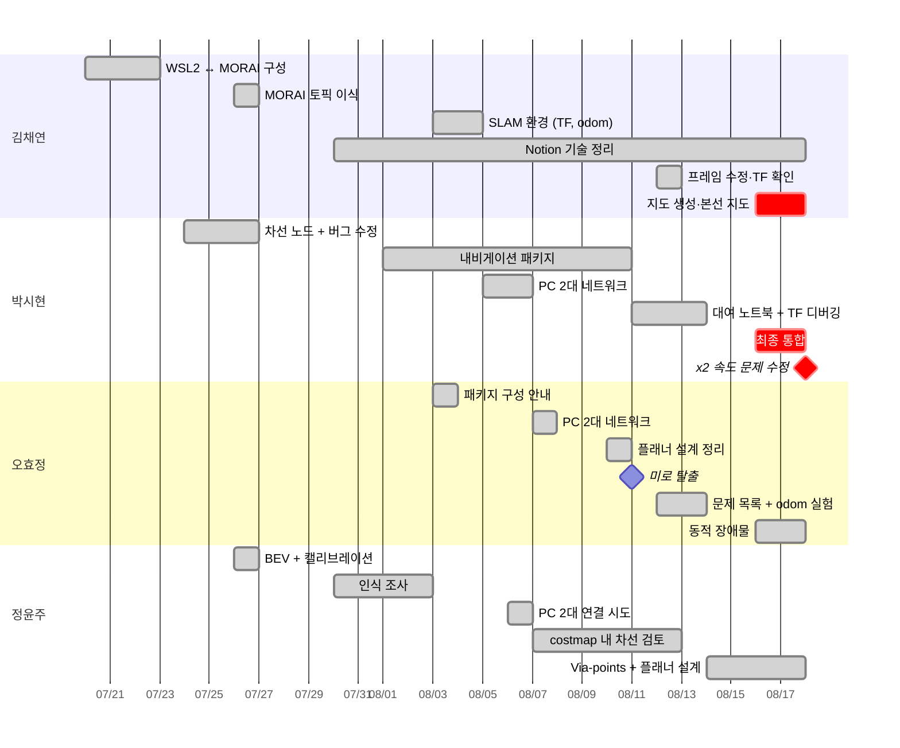

# 팀 기여

[← README](../README_ko.md) · [English](contributions.md) | **한국어**

## 기여 요약

◎ 주도 · ○ 적극 참여 · △ 참여

| | 영역 | **김채연** @ChaeYeonKim0204 | **박시현** @kha-2 | **오효정** @ohhyojeong | **정윤주** @yoonju04 |
|---|---|:---:|:---:|:---:|:---:|
| 프로젝트 | 팀 운영 (회의·일정·장소·대회 측 연락) | ○ | △ | △ | ◎ |
| | 예선 (기술 스택·계획서·구조도·발표 자료) | ◎ | ○ | ○ | ○ |
| | 개발 환경·네트워크 (WSL2 ↔ MORAI·공용 PC·2-PC 이더넷) | ◎ | ○ | ○ | △ |
| 주행 스택 | 인지 (차선·BEV·신호등·보행자·장애물) | ○ | ◎ | ○ | ○ |
| | 지도 작성 (SLAM) | ◎ | ○ | ○ | △ |
| | 위치 추정 (AMCL·TF·odometry) | ○ | ◎ | ◎ |  |
| | 경로 계획·제어 (move_base·TEB·costmap·속도) | △ | ◎ | ○ | ○ |
| | 미션 로직·통합 (navigation client·배달·최종 스택) | △ | ◎ | △ |  |
| 공통 | 문서화 (Notion 정리·설치 가이드·GitHub) | ◎ | ○ | ○ | ○ |

## 팀원별 작업 일정

---

## 김채연

[@ChaeYeonKim0204](https://github.com/ChaeYeonKim0204) · 개발 환경 · SLAM 지도 생성 · 문서 · 운영

| 날짜 | 작업 | 결과 |
|---|---|---|
| 06.24 | 예선: 기술 스택 (PRM, TEB, YOLO, OpenCV, Behavior Tree, Pure Pursuit)·연구개발 계획 개요 (역할·목표·전략·기술·학습 계획) 작성, AI 검토로 일정·파이프라인 추가 후 슬라이드·대본 수정, 공용 슬라이드 제공 | 06.24 발표 자료 |
| 07.07~07.08 | 팀 MORAI 계정 구성 공유, 예비 환경 계획 (예비 PC 듀얼부팅) | WSL2 도입 후 불필요 |
| 07.17 | SEA:ME 해커톤 차량용 차선 제어 함수 `compute_pd_control` 작성 | 대회 차선 노드에 재사용 (07.26) |
| 07.20~07.23 | VM의 GPU 접근 불가로 MORAI 종료 확인, Windows에서 MORAI·WSL2에서 ROS Noetic 실행 | **팀 표준 환경** (07.23), 해당 노트북을 공용 PC로 사용 |
| 07.22 | 이더넷 기반 PC 2대로 MORAI·ROS 분리 제안 | 08.06부터 사용 |
| 07.26 | rosbridge 실행 명령 공유 (13:44), 박시현의 07.24 차선 노드를 MORAI 카메라/서보/모터 토픽에 맞게 이식 (14:53), 제어 토픽 단위 정리 (21:42) | MORAI 연동 첫 차선 노드 · 속도 300 = 1 km/h, 서보 0.5 = 직진 |
| 07.29 | WSL ↔ Windows 네트워크 안내 (핵심: rosbridge용 `netsh portproxy 9090`) | WSL2의 ROS와 MORAI 연결에 사용 |
| 08.03 | 규정서 센서 위치에 따른 gmapping용 static TF (imu 0, 0, 0.12 · lidar 0.11, 0, 0.13)·`pub_odom` launch | SLAM 구성 커밋 |
| 08.03~08.04 | 첫 SLAM 실행 | 지도 왜곡, gmapping 반복 종료 |
| 08.03~08.06 | 지도 겹침 후 Day 7 강의 재학습, Notion에 SLAM 구성 절차 (패키지·launch·주석 처리 대상) 정리·gmapping 파라미터 설정 | 첫 사용 가능한 지도 생성 (08.07) 전 준비 |
| 08.11 | 팀 설정과 Day 8 강의 비교 | 누락된 costmap 설정 확인 (08.12 적용, 속도 변화 없음) |
| 08.12 | 프레임 `map` → `odom` 복구 제안, 이후 rqt TF에서 `base_link` 연결 끊김 확인 | TF 떨림 해소, odometry 갱신 중단 원인 설명 |
| 08.13 | 배달 목표 x, y, z → quaternion | Euler → quaternion 변환 제안 |
| 08.15~08.16 | 공용 PC의 갑작스러운 costmap 변경 디버깅 | 원인 기록 없음 |
| 08.16~08.18 | gmapping 18회 실행, 지도 4개 저장 | **본선 지도: 주행당 경로 계획 실패 17–71회 → 0–5회** |
| 08.18 | `/amcl_pose`에서 도로 waypoint 재기록 | `amcl_waypoint_today2.csv` |
| 전 기간 | Notion 정리 (Day 7 SLAM/EKF/AMCL, Day 8 Navigation), 대회 측 연락, GitHub | 공용 지식 자료·일정 |

## 박시현

[@kha-2](https://github.com/kha-2) · 차선·신호등 · 내비게이션 패키지 · TF 디버깅 · 최종 통합 · 배달

| 날짜 | 작업 | 결과 |
|---|---|---|
| 06.23 | 예선: 제어·장애물 회피 조사 후 센서·인식 담당, 시스템 아키텍처 초안 게시 (v1, v2에 SLAM → TF → Nav2·DWB 컨트롤러 추가) | 슬라이드용 아키텍처 |
| 07.16 | SEA:ME 해커톤 차량용 `plothistogram` / `sliding_window` 작성 | 대회 차선 노드에 재사용 |
| 07.24 | 초기 차선 노드: HSV → ROI → sliding windows → 조향 (입력 `/camera/image_raw`, 출력 `/commands/vel`) | `lane_following` 기본 코드 |
| 07.26 | 노란 차선 마스크, `waitKey`·히스토그램 수정, 07.24 추가한 차선 위치 검사 제거 | **오른쪽 차선 검출 복구** |
| 07.26 | 첫 신호등 정지 시도 (`GetTrafficLightStatus`) | 아직 동작 불가 (토픽 오타, 메인 루프가 정지 명령 덮어씀) |
| 07.29~07.31 | 오프라인 교육, 오효정과 강사에게 절대좌표 금지 규칙 문의 | 강사 카메라 기반 주행 제안, 팀은 SLAM + AMCL + waypoint 유지 |
| 08.01~08.10 | `wego` / `wego_2d_nav` 기본 구조, 좌표 변환, waypoint 재샘플링, 초기 내비게이션 클라이언트 | 내비게이션 스택 구성 (브랜치 `history/sihyeon-laptop-2025-08`) |
| 08.05~08.07 | 정윤주와 PC 2대 연결 시도 (08.06), 오효정과 정상 연결 (08.07) | 주행 PC에서 전체 토픽 확인 |
| 08.07 | 첫 지도 유실 후 SLAM 지도 생성 (오효정 주행) | 08.07~08.15 주행용 지도 |
| 08.11 | 대여 노트북 이전·빌드 수정, TEB의 `cmd_vel` 생성 과정 추적 | 여전히 저속 → 성능 가설 제외 |
| 08.12 | TF/odom/위치 추정 디버깅 주 실행자 (프레임 변경 적용·실험·보고) | 떨림 해소 후 위치 추적 복구, 여전히 저속 |
| 08.13 | 전역 경로가 너무 좁다는 가설, `cost_scaling_factor` 하향 | 소폭 개선 |
| 08.13~08.17 | x, y, z와 quaternion 문제 제기, 배달 코드 작성 | 미통합 |
| 08.16~08.18 | 공용 PC로 스택 이식, TEB 빌드, 미로 → 도로 클라이언트, AMCL 튜닝 | 본선 스택 |
| 08.18 15:34 | 모터 배율 ×2 주석 해제 | **다음 주행 시작 약 2.5분 후 미로 탈출** |

## 오효정

[@ohhyojeong](https://github.com/ohhyojeong) · 패키지 구성 · Odometry·문제 분석 · 플래너 설계 · 동적 장애물

| 날짜 | 작업 | 결과 |
|---|---|---|
| 06.24 | 예선: 위험 대응 절 작성 (센서 융합, Behavior Tree 조건 노드, 감속 / 회피 / 정지) | 계획서 일부 |
| 07.30 | 강사의 HOG 보행자 검출 예제 공유·실험 | 실시간 처리에 너무 느림 |
| 08.03 | Lecture 6 구성 안내 (static TF, `convert_lidar`, `pub_odom`), MGeo publisher 예제 | 같은 날 저장소 반영 |
| 08.05 | LiDAR TF 위치 확인 제안 | SLAM 디버깅에 참고 |
| 08.07 | 박시현과 이더넷 연결·전체 토픽 동작 확인, 지도 기록 중 차량 주행 | PC 2대 구성 사용 |
| 08.10 | 전역 플래너 설계 정리: 구간별 Dijkstra 연결, 필수 통과 지점에만 waypoint, TEB via-points를 쓰지 않는 이유 | 경로 계획 방식 문서화 |
| 08.11 | 미로 전용 목표로 미로 주행, `max_vel_x` 상향 효과 없음 | **첫 미로 탈출 · TEB 버그의 첫 단서** |
| 08.12 | 미해결 문제 3개 정리 (지역 경로, 정지 중 `/odom` 튐, `base_link` TF), rqt 파라미터 분석 | 이후 스크린샷으로 TEB 기본값 사용 입증 |
| 08.13 | `pub_odom.py` vs 듀얼 EKF vs `publish_tf: false` | 장단점 문서화 (정확도 vs TF 떨림 vs TF 연결 끊김) |
| 08.16~08.18 | DBSCAN 클러스터링 → 속도 → 보행자/차량 분류, 신호등 처리 | 미통합 |

## 정윤주

[@yoonju04](https://github.com/yoonju04) · **팀장** · 카메라 인식 · 차선·플래너 설계

| 날짜 | 작업 | 결과 |
|---|---|---|
| 05.21 | 대회 발견·참가 제안 | 팀 참가 |
| 06.23~06.24 | 예선: 역할 분담 조율, 질의응답 준비 제안, 가상환경 검증이 필요한 이유 작성 | 06.24 발표 (결과 기록 없음) |
| 07.23 | 강의 차선 파이프라인 분석 | 가상 카메라에 BEV 필요 판단 |
| 07.24 | 구성에서 카메라 노드 부재 확인 | rosbridge 카메라 토픽 사용으로 연결 |
| 07.26 | 카메라 캘리브레이션 + BEV 변환 | `bird` 커밋 (같은 날 저녁 제외, 이유 기록 없음) |
| 07.30 | HOG (약 5 fps) vs YOLOv4 (약 70 fps) 수치 조사 | 인식의 딥러닝 방향 선택 (미구현) |
| 08.03 | 첫 `slam_gmapping` 실행 | 지도 품질 불량 (08.04 확인) |
| 08.06 | 박시현과 이더넷 기반 PC 2대 연결 시도 | 연결 성공, `rostopic list` 비어 있음 |
| 08.07~08.13 | 차선을 costmap 장애물로 처리 | **다중·교차 차선에서 실패 확인** |
| 08.14~08.16 | 차선 중심선 → TEB via-points, 중심선 publisher | 설계 (미통합) |
| 08.15~08.16 | 정지 원인을 지도 문제가 아닌 플래너 문제로 진단 | 플래너로 분석 초점 이동 |
| 08.14~08.18 | Waypoint, A*, SBPL 전역 플래너 | 대안 문서화 |
| 전 기간 | **팀장**: 회의 진행, 일정·역할 분담 | 팀 작업 지속 |

---

## 최종 코드 미포함 작업

| 작업 | 담당 |
|---|---|
| 신호등 정지 | 박시현 (07.26 시도), 오효정 (08.18) |
| 배달 미션 | 박시현 |
| 동적 장애물 (DBSCAN, 분류) | 오효정 |
| 노란 차선 마스크, BEV + 캘리브레이션 | 박시현, 정윤주 |
| 차선 중심선 → TEB via-points | 정윤주 |
| Waypoint / A* / SBPL 플래너 | 정윤주 (김채연도 조사) |
| 좌표 변환, waypoint 재샘플링 | 박시현 (브랜치 `history/sihyeon-laptop-2025-08`) |

## 근거·주의점

- 팀 채팅 (07.20~08.18), Notion 페이지, Git 저장소 2개, Notion 첨부 작업 공간 스냅샷, 공용 PC 편집 이력·ROS 로그, 기록이 없는 부분은 김채연 회고
- 공용 PC가 해당 노트북이어서 `main`의 모든 커밋 작성자는 `ChaeYeonKim0204`임, 실제 기여자는 `Co-authored-by`에 기록
- 공용 노트북에서 전송한 일부 메시지로 인해 채팅 계정과 작성자가 항상 같지는 않음, 해당 사례는 팀 확인
